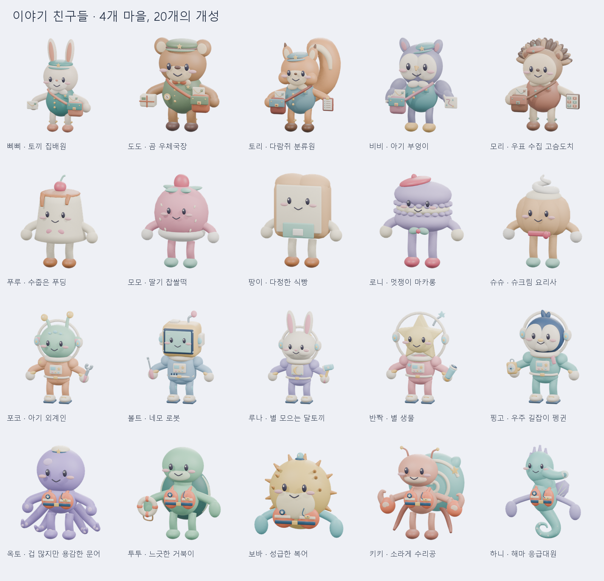

# 이야기 친구들 20종 — Blender / Unity 모델 팩 v002

2026-10-06 어깨 연결 보완판. 어깨 위치를 각 몸통 안으로 옮기고 팔 안쪽 가중치를 몸통에 고정했습니다. 모든 동작 프레임에서 실제 스킨 연결을 검사했습니다. 이전 v001 파일은 별도 보존합니다. 같은 Unity 자산 경로와 GUID를 사용하므로 이 패키지를 다시 가져오면 기존 모델을 갱신합니다. 숲속 우체국, 한입 디저트 마을, 꼬마 우주 정비소, 바닷속 작은 구조대 각각 5종. 외부 모델·텍스처·폰트 자산 없이 절차적으로 만든 모델입니다. 이전 날씨 요정 파일은 이 묶음에 포함하지 않습니다.

## 가장 빠른 Unity 사용법

1. Unity 6의 **URP 프로젝트**에서 `Assets → Import Package → Custom Package`로 `StorybookCast-Unity6-URP-v002.unitypackage`를 불러옵니다. 필요한 주제만 사용할 때는 `Forest-Unity6-URP-v002.unitypackage` 등 주제별 파일을 가져옵니다. 주제별 패키지는 같은 공통 스크립트 GUID를 공유하므로 함께 설치할 수 있습니다.
2. `Assets/StorybookCast/Themes/<주제>/Scenes/<주제>Showcase.unity`를 열고 ▶ Play를 누릅니다. 그 주제의 다섯 캐릭터가 8개 동작을 순서대로 보여 줍니다.
3. 내 장면에서는 `.../<주제>/Prefabs/<파일 키>.prefab`을 Hierarchy에 끌어 놓습니다. 재질과 Animator가 이미 연결되어 있습니다.
4. Play 중 캐릭터의 **Storybook Character → Motion**을 바꾸거나 코드에서 `character.Play(StorybookCast.CastMotion.Walk);`를 호출합니다. 시연 Scene에서 직접 조작할 때는 `Storybook Motion Demo → Auto Cycle`을 먼저 끕니다.
5. 표정을 직접 바꾸려면 **Manual Face**를 켠 뒤 Blink / Smile / Surprise를 0~1로 조절합니다. 꺼져 있으면 각 동작에 포함된 표정을 사용합니다. Surprise가 커질수록 Smile은 자동으로 줄어듭니다.

모델은 **Generic** 리그입니다. Humanoid Avatar로 변경하지 마세요. 이동 애니메이션은 **제자리 동작**이며 실제 전진은 게임 코드의 Transform/CharacterController/NavMesh 이동과 함께 사용합니다. 정면은 Unity **−Z**, 위는 +Y, 발/꼬리 바닥 기준은 Y=0입니다. +Z 이동 규칙을 쓰는 게임은 Prefab의 자식 모델만 Y축 180° 회전한 부모를 만들어 사용하세요. 모델 높이는 약 2~3 단위이므로 부모 Transform으로 용도에 맞게 함께 축소할 수 있습니다.

## 포함 동작 — 20종 × 8개 = 160개 클립

| 클립 | 의미 | 길이 | 반복 / 연결 |
|---|---|---|---|
| Idle | 대기·숨쉬기 | 2초 | 반복 |
| Walk | 걷기 | 2초 | 반복 |
| Run | 달리기 | 2초 | 반복 |
| SitDown | 앉기 | 1.5초 | SitIdle로 자동 연결 |
| SitIdle | 앉아서 쉬기 | 2초 | 반복 |
| StandUp | 일어나기 | 1.5초 | Idle로 자동 연결 |
| Wave | 손 흔들어 인사 | 2초 | Idle로 자동 연결 |
| Celebrate | 기뻐하기 | 2초 | Idle로 자동 연결 |

복어 **보바**와 해마 **하니**의 Walk/Run은 느린/빠른 **헤엄**입니다. 앉기는 몸을 낮추는 휴식 자세이며, 해마는 긴 몸을 낮추고 꼬리로 지탱합니다. 각 캐릭터의 귀·꼬리·촉수·안테나·장식도 해당 뼈를 따라 움직입니다. 데모 영상은 약 15.33초/24fps/1280×720, 무음입니다. Scene의 자동 시연은 18초 순환합니다.

## 파일 구성

- `<주제>/blender/<파일 키>.blend`: 캐릭터 1명만 있는 독립 Blender 원본. 하나의 Armature, 하나의 스킨 메시, 8개 개별 Action과 내보내기용 AllMotions Action을 포함합니다.
- `unity/Assets/StorybookCast/Themes/<주제>/Models/<파일 키>.fbx`: 캐릭터별 Unity 호환 모델과 베이크된 뼈/표정 애니메이션.
- `unity/Assets/.../Prefabs`, `Controllers`, `Materials`, `Scenes`: 연결을 마친 Unity 자산과 `.meta`.
- `unity/Assets/Scripts/StorybookCast`: 런타임 캐릭터/시연 컴포넌트, Editor 반입·검증 도구.
- `previews/`: 20종 개별 PNG, 전체 목록, Unity 미리보기와 주제별 동작 MP4.
- `<주제>-Models-v002.zip`: 해당 주제의 Blender 5개, FBX 5개, Unity 패키지, 미리보기, 이 사용법.
- `SHA256SUMS.json`: 전달 파일 무결성 목록. ZIP 자체는 ZIP 안에 중복 포함하지 않습니다.

Unity 패키지에 포함된 `.meta`를 유지해야 클립 범위·재질·Prefab 참조가 보존됩니다. `unity/Assets`를 복사하는 방식도 가능하지만 기존 동일 경로 자산을 수정한 프로젝트에서는 백업 후 병합하세요. FBX 하나만 가져오면 한 개의 긴 Take가 보일 수 있습니다. Model Importer의 Animation에서 아래 프레임으로 분할하거나 포함된 패키지를 사용하세요. `Tools → Storybook Cast → Prepare Imported Themes`는 존재하는 주제의 모델 반입 설정과 Prefab/Animator를 재구성하는 편집 도구입니다.

| 클립 | FBX 범위(Blender 24fps, 시작 프레임 1 기준) |
|---|---|
| Idle | 1–49 |
| Walk | 50–98 |
| Run | 99–147 |
| SitDown | 148–184 |
| SitIdle | 185–233 |
| StandUp | 234–270 |
| Wave | 271–319 |
| Celebrate | 320–368 |

Unity Importer가 첫 프레임을 0으로 표시하는 경우 각 숫자에서 1을 빼세요. 포함 Editor 설정은 실제 Take의 firstFrame을 읽어 이 차이를 자동 처리합니다.

## Blender에서 다시 편집하기

Blender 5.2.1 LTS에서 검증했습니다. 각 `.blend`를 열면 Idle의 1프레임, Pose Mode, CTRL_Body 선택 상태입니다. `CTRL_Hand.L/R`와 `CTRL_Foot.L/R`은 2관절 IK, `CTRL_Body`와 `CTRL_Head`는 몸/머리, `CTRL_Face`의 사용자 속성은 표정입니다. Extras Bone Collection에서 귀·꼬리 등 추가 뼈를 조절합니다. Action Editor에서 해당 캐릭터의 Idle / Walk / Run / SitDown / SitIdle / StandUp / Wave / Celebrate를 골라 수정하세요. 원본을 보존하려면 새 버전으로 저장합니다.

Blender의 IK 제약과 표정 driver는 **원본 파일에 유지**되어 있습니다. Unity에서는 평가한 결과를 애니메이션으로 재생합니다. Unity 실시간 IK solver, Humanoid 리타게팅, 이동/충돌/게임플레이 로직은 이 모델 팩에 포함하지 않습니다.

## 제작 목록

| 주제 | 이름 / 파일 키 | 캐릭터 |
|---|---|---|
| 숲속 우체국 친구들 | 삐삐 / `PipiRabbit` | 토끼 집배원 |
| 숲속 우체국 친구들 | 도도 / `DodoBear` | 곰 우체국장 |
| 숲속 우체국 친구들 | 토리 / `ToriSquirrel` | 다람쥐 분류원 |
| 숲속 우체국 친구들 | 비비 / `BibiOwl` | 아기 부엉이 |
| 숲속 우체국 친구들 | 모리 / `MoriHedgehog` | 우표 수집 고슴도치 |
| 한입 디저트 마을 | 푸루 / `PuruPudding` | 수줍은 푸딩 |
| 한입 디저트 마을 | 모모 / `MomoMochi` | 딸기 찹쌀떡 |
| 한입 디저트 마을 | 팡이 / `PanBread` | 다정한 식빵 |
| 한입 디저트 마을 | 로니 / `RoniMacaron` | 멋쟁이 마카롱 |
| 한입 디저트 마을 | 슈슈 / `ShushuPuff` | 슈크림 요리사 |
| 꼬마 우주 정비소 | 포코 / `PokoAlien` | 아기 외계인 |
| 꼬마 우주 정비소 | 볼트 / `BoltRobot` | 네모 로봇 |
| 꼬마 우주 정비소 | 루나 / `LunaRabbit` | 별 모으는 달토끼 |
| 꼬마 우주 정비소 | 반짝 / `TwinkleStar` | 별 생물 |
| 꼬마 우주 정비소 | 핑고 / `PingoPenguin` | 우주 길잡이 펭귄 |
| 바닷속 작은 구조대 | 옥토 / `OctoOctopus` | 겁 많지만 용감한 문어 |
| 바닷속 작은 구조대 | 투투 / `TutuTurtle` | 느긋한 거북이 |
| 바닷속 작은 구조대 | 보바 / `BobaPuffer` | 성급한 복어 |
| 바닷속 작은 구조대 | 키키 / `KikiHermit` | 소라게 수리공 |
| 바닷속 작은 구조대 | 하니 / `HaniSeahorse` | 해마 응급대원 |

## 검증과 사용 범위

- 20개 원본 독립 재개방, 캐릭터당 1 스킨 메시 / 3 얼굴 ShapeKey / 22~38뼈 / 2,920~20,078원본 정점. FBX 반입에서는 재질·법선 경계의 정점 분리로 수가 늘 수 있습니다.
- 가중치 정규화, 누락 뼈·외부 의존 없음, driver 유효, 바닥/반복 연결/실제 보행 변형/앉은 높이 변화 확인.
- Unity **6000.3.25f1 / URP 17.3.0 / Windows**에서 20개 Generic Avatar, 160개 클립, URP 재질을 검사했습니다. 실제 Play Mode의 160개 상태 전환, 스킨 변형, SitDown→SitIdle, 표정 수동 제어도 확인했습니다.
- LOD, 모바일 성능 최적화, 다른 Unity 버전·Built-in/HDRP·기기 빌드는 별도 검증이 필요합니다. 모델당 여러 색상 재질을 쓰므로 대량 배치에는 재질 아틀라스/LOD 작업을 권합니다.
- 절차형 부품 메시를 하나의 스킨 메시로 합친 캐릭터입니다. 3D 프린팅용 수밀/단일 연속 표면 모델은 아닙니다.

제작 소스와 검증 기록: 저장소 `workflows/storybook-cast/`, `outputs/storybook-cast/v002/`. 이 사용법의 경로는 이 전달 폴더를 기준으로 합니다.
