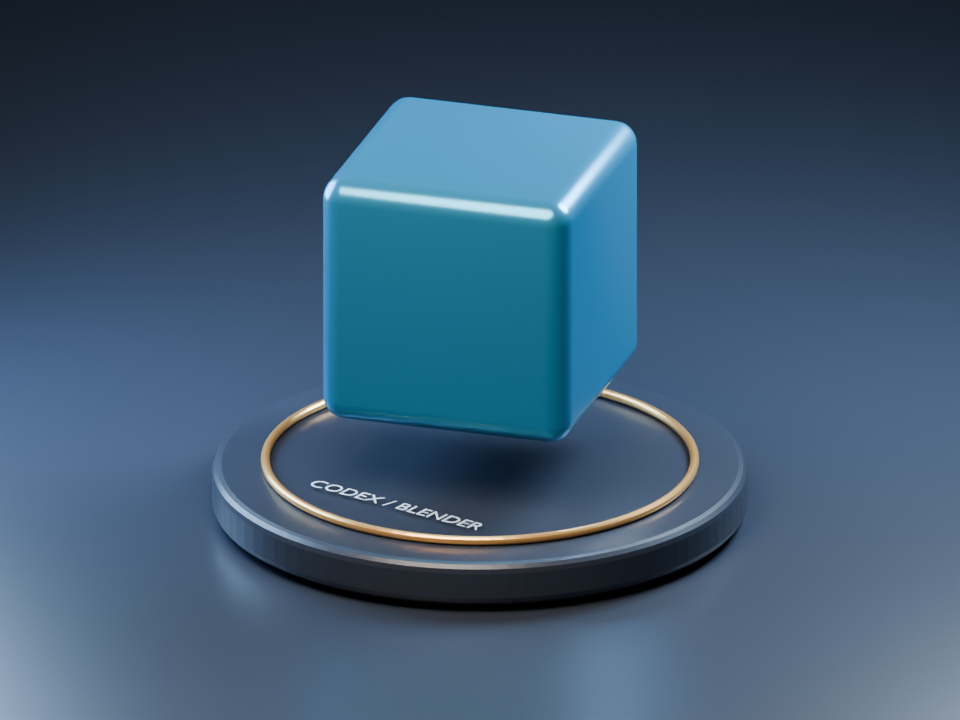
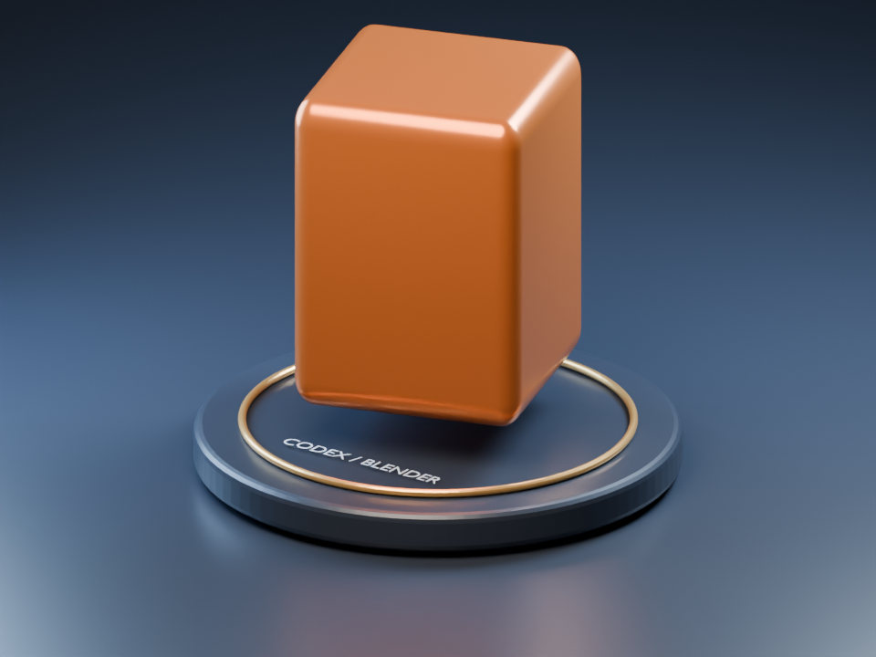

# 최초 연결 시연

첫 단계는 파란 물체를 만들고, 두 번째 단계는 색을 주황색으로 바꾸고 높이를 늘렸습니다. 각각 실제 Blender에서 렌더한 이미지입니다.

현재 원본은 `../../scenes/current.blend`입니다. 변경 전후 원본과 실행 이력은 `../jobs/20260909T143917-5960d9a704/`, `../jobs/20260909T143952-0cf115ac7f/`에 있습니다.
