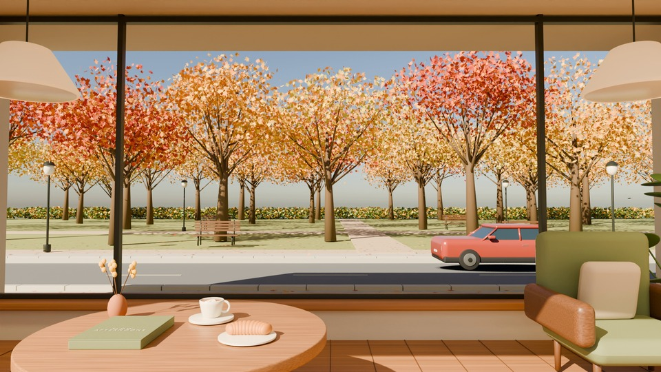

# 가을, 느린 오후

2026-10-02 요청: 브리찌로 카페 통창 안쪽에서 가을 공원을 바라보는 코지한 영상.
맑은 오후 3시, 카페와 공원 사이 좁은 도로, 낙엽과 불규칙하게 지나가는 여러 차량.
20초 무한 루프이며 첫 프레임과 마지막 프레임이 같은 결과를 만든다.

## 제작과 출력

- 전용 Scene `Autumn_Cafe_v001`, 카메라 `AC_Camera`. 기존 Scene과 결과는 보존한다.
- 절차적 Blender CG: 오크 테이블, 커피잔, 크루아상, 책과 작은 화병, 올리브색 의자,
  린넨 펜던트, 통창, 단풍나무 33그루와 벤치·산책로, 2차로 도로.
- 차량 6대는 양방향으로 서로 다른 간격에 등장한다. 난수 시드와 위상을 고정하여
  자연스럽게 불규칙한 교통 패턴을 정확히 반복한다. 매 반복마다 새 난수를 만들지 않는다.
- 낙엽 56개가 개별 경로로 천천히 떨어지고 회전한다. 카메라와 조명은 고정한다.
- 1920×1080 / 24fps / 480프레임 / 정확히 20초 / 무음.
- 프레임 1과 480은 같은 시간 위상이다. 479간격의 동작 뒤 동일 끝점을 한 장 포함한다.
  이로 인해 반복 경계에 한 프레임(1/24초) 길이의 동일 화면이 있으며 사용자의 끝점 일치 조건을 우선한다.
- 맑은 오후 분위기는 고도 34도 태양으로 연출했다. 특정 장소/날짜의 천문 시뮬레이션은 아니다.

## 파일

- 편집 원본: `scenes/autumn-cafe-v001.blend` (이 작업의 Scene과 의존 데이터만 포함).
- 현장 작업 원본: `scenes/current.blend` (기존 Scene까지 보존).
- 결과: `outputs/autumn-cafe/v001/autumn-cafe-20s-loop.mp4`.
- 같은 결과 폴더: `play-loop.html`, `poster.png`, `autumn-cafe-preview.gif`, `verification.json`.
- 선형 HDR 배경: `assets/autumn-cafe/v001/afternoon-background-final.exr`; 원본에 pack.
- `assets/`, `outputs/`는 저장소 기본 제외 규칙을 유지한다. Git에는 제작 코드와
  별도 Blender 원본 및 검증 요약을 보관한다. 이 원본의 배경은 pack되어 복원에 외부 파일이 필요 없다.

## 재현

브리찌의 `run --script workflows/autumn-cafe/<파일> --label <설명>`으로 순서대로 실행한다.
이미 완성된 Scene에 생성 스크립트를 다시 실행하지 않는다.
완성 원본을 다른 PC에서 여는 명령은 `scripts/blender.ps1 start --file scenes/autumn-cafe-v001.blend`다.
작업 시작 전부터 수정되어 있던 `scenes/current.blend`와 이전 작업 파일은 일괄 커밋하지 않는다.

1. `01_build_scene.py`: 독립 장면 생성. Blender 5.2 Sky API에 맞춰 수정된 재현 코드.
2. `01c_refine_light.py`: 맑은 창, 햇빛 노출, 부드러운 실내 조명.
3. `01d_finish_details.py`: 펜던트와 소품, 배경 초안 보강.
4. `02_lock_background.py`: 정적 배경 렌더 및 차량/낙엽 합성 레이어.
5. `02b_refine_understory.py`: 관목을 개별 잎 메시로 정리하고 최종 배경을 새 이름으로 렌더.
6. `03_render_loop.py`: 변환 끝점 검사, 본편 479장과 독립 끝점 렌더, 동일한 마지막 PNG,
   관련 Scene만 포함한 별도 `.blend` 저장.
7. 일반 Python에서 `04_package_verify.py`: PNG, 정적 영역, MP4 길이·프레임·전체 디코딩·
   실제 압축 영상 끝점 일치 검사, GIF와 플레이어 생성. Pillow/NumPy 및 FFmpeg 사용.
8. 별도 Blender에서 전용 원본을 열어 `10_finalize_standalone.py`로 일반 프로젝트 형식으로
   저장하고 `07_verify_saved_scene.py`로 재개방·pack·평가된 동작을 검사한다.

`01b_finish_sky.py`는 최초 실행에서 하늘 enum이 변경되어 중단된 지점만 복구한 이력이다.
정상 재현에서는 실행하지 않는다. 실패 작업/백업/실행 로그도 `outputs/jobs/`에 보존했다.
`06_finalize_scene.py`는 이 PC에 이미 있던 과거 원본의 Scene을 현재 작업 파일에 합친 보존 절차다.
그 과정의 JSON 기록 오류만 `06b_finish_record.py`에서 복구했으며 전용 납품 원본에는 가을 Scene만 있다.
`08_inspect_static_pixel.py`, `09_inspect_loaded_drivers.py`는 검증 진단 이력이다.

## 안정성과 제한

Cycles OptiX로 정적 카페/공원을 160 samples에서 한 번 렌더하고 선형 EXR로 pack한다.
차량과 낙엽만 32 samples에서 렌더하여 카페 물체의 holdout과 합성한다.
고정 배경은 프레임마다 재조명되지 않아 실내 조명·테이블·창틀의 깜빡임을 방지한다.
차량에는 부드러운 접촉 그림자를 따로 구성했다. 배경에 움직이는 차량의 반사나
낙엽 그림자는 재계산하지 않는다. 카메라/실내/공원/조명이 바뀌면 배경을 다시 렌더해야 한다.
외부 자산 다운로드, 유료 서비스, 애드온 설치는 없다. Windows / Blender 5.2.1 / RTX 3090 검증.

최종 실측 검증 요약은 `verification-summary.json`에 기록한다.

## 최종 검증

- MP4 10,455,437바이트, 480프레임, 정확히 20초. 전체 디코딩 통과.
- 전달 MP4의 첫·마지막 디코딩 이미지가 픽셀 단위로 동일하다.
- 9개 정적 ROI의 480장 PNG 변화는 0. MP4의 최대 프레임 평균 편차는 0.080/255 미만이다.
- 압축 과정의 재구성 편차를 줄이기 위해 최종 인코딩은 H.264 고정 QP 6을 사용한다.
- 독립적인 끝점 렌더 차이는 평균 0.000001/255 미만, 최대 1/255이며,
  실제 납품 마지막 PNG는 첫 PNG의 복사본으로 정확한 동일 화면을 보장한다.
- 재개방한 원본은 가을 Scene 1개, 객체 2,120개, 유효한 움직임 62개이며 끝점 변환 오차 0이다.
- 포스터와 6개 시점의 움직임 시트를 직접 확인했다. 기존 원본 4개 SHA-256 유지.
- 최초 단일 픽셀 차이는 별도 스캔에서 재현되지 않았으며, 엄격한 전체 재검사에서 변화 0을 확인했다.
